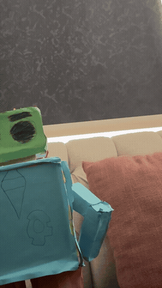
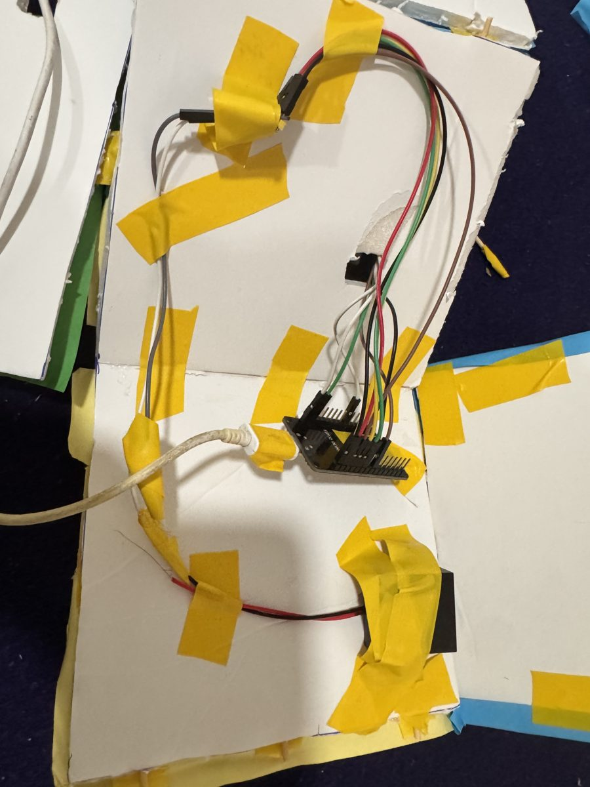
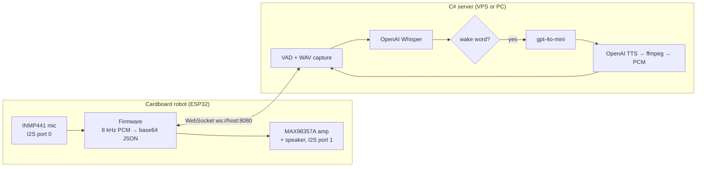

# Cardboard Robot: an ESP32 voice assistant

A hand-made cardboard robot that listens to you, thinks with ChatGPT, and talks
back through a little speaker. An ESP32 inside the chest streams the microphone
to a small C# server; the server does speech-to-text (Whisper), checks for a wake
word, asks ChatGPT for a short answer, turns it into speech (OpenAI TTS) and
streams the audio back to the robot.

<p align="center">
  
  
  
</p>

Say **"hello robot, tell me a joke"** and:

1. three quick beeps: the robot heard the end of your sentence,
2. one beep: the server recognised the wake word and is preparing an answer,
3. the answer plays through the speaker (the mic is muted meanwhile so the robot
   does not listen to itself).

A 38-second demo video is in [`docs/media/demo.mp4`](docs/media/demo.mp4).

> **Status (September 2026):** the robot and the pipeline worked end to end in
> April 2026. Before publication the server was cleaned up (key from the
> environment, safety fixes) and smoke-tested with a simulated robot, but the
> OpenAI calls and the full chain have **not yet been re-tested with a real API
> key on the robot**. If you build one, expect to spend a few minutes tuning
> `VadNoiseOffset` and the speaker gain for your room and hardware.

## How it works



- **Firmware** (`firmware/`, Arduino C++): reads the I2S microphone, batches 192 ms
  of audio into one JSON message, plays incoming TTS chunks as they arrive, and
  beeps for feedback. Two FreeRTOS tasks keep the WebSocket responsive.
- **Audio rate**: 8 kHz mono on both sides. That is on purpose: 16 kHz sounded
  a little clearer but the answers stuttered on a phone hotspot; 8 kHz halves the
  bandwidth and plays smoothly. Both sides must use the same rate
  (`AUDIO_SAMPLE_RATE` in the firmware, `ROBOT_SAMPLE_RATE` on the server).
- **Server** (`server/`, .NET 8, one file): a WebSocket listener with a
  self-calibrating voice-activity detector. Each detected sentence is written to a
  WAV file, transcribed, checked for a wake word, answered, spoken, and streamed
  back in 2 KB chunks.
- **Protocol**: plain JSON over one WebSocket, described in
  [`docs/protocol.md`](docs/protocol.md).

## Repository layout

```
firmware/
  esp32_voice_assistant/   the firmware running on the robot (+ secrets.h.example)
  hardware_tests/          speaker beep test, microphone stream test
  experimental/            the same firmware with review fixes, not yet tested on hardware
  README.md                Arduino IDE setup, flashing, tuning knobs
server/
  Program.cs, server.csproj   the server (config via environment variables)
  deploy/robot-server.service systemd unit for a Linux VPS
  README.md                run locally / deploy / cost notes
docs/
  hardware.md              bill of materials, wiring tables, gotchas, photos
  protocol.md              every WebSocket message, sizes and timing
  history.md               how the code evolved through 60+ prototype versions
  release-checklist.md     what to do before publishing (key rotation, cleanup)
  images/, media/          web-sized photos, demo clip
experiments/whisper-test/  the very first experiment: send a WAV to Whisper
archive/
  firmware-versions/       all 60 prototype .ino files (credentials removed)
  server-original/         the April server exactly as it ran (key removed)
  README.md                dated index of every archived version
media/                     original photos and videos (git-ignored, large)
```

## Build your own

1. **Hardware**: an ESP32 DevKit, an INMP441 microphone, a MAX98357A amplifier, a
   small speaker and a power bank. Wiring tables and the parts list are in
   [`docs/hardware.md`](docs/hardware.md).
2. **Server**: you need **your own OpenAI API key**. Create one at
   https://platform.openai.com/api-keys (every question costs a fraction of a
   cent for Whisper, gpt-4o-mini and TTS, billed to your account). Install .NET 8
   and `ffmpeg`, set `OPENAI_API_KEY`, run `dotnet run` in `server/`. Details and
   a VPS deployment recipe are in [`server/README.md`](server/README.md). (A
   `ROBOT_AUTH_TOKEN` can lock the server to your robot; it needs the
   experimental firmware, see below.)
3. **Firmware**: install the ESP32 board package and the *WebSockets* library in
   the Arduino IDE, copy `secrets.h.example` to `secrets.h`, fill in your WiFi and
   server address, flash `firmware/esp32_voice_assistant`. See
   [`firmware/README.md`](firmware/README.md).
4. Keep quiet for three seconds after the robot connects (the server measures the
   background noise), then talk to it.

Wake words default to `assistant`, `hello`, `robot`; change them, the language and
the voice with environment variables on the server (the early prototypes used the
Arabic wake word "مساعد", and Whisper handles Arabic fine with `ROBOT_LANGUAGE=ar`).

## Known limitations

- Audio goes over a plain `ws://` connection. Use it on your LAN or a VPS you
  control. The main firmware sends no authentication, so either firewall the port
  to your own IP or flash `firmware/experimental/` and set `ROBOT_AUTH_TOKEN` on
  both sides so strangers cannot spend your OpenAI credit.
- The main firmware is the tested one and has a few known rough edges (it stays
  muted if the server never answers after a wake beep, the last ~0.1 s of an
  answer is cut). They are fixed in `firmware/experimental/`, which still needs a
  test on the robot. See [`docs/release-checklist.md`](docs/release-checklist.md).
- Every sentence the VAD detects is transcribed by Whisper, wake word or not. A
  noisy room costs money; raise `VadNoiseOffset` in the server if that happens.
- Answers are limited to 2-3 sentences by the system prompt; there is no
  conversation memory between questions.
- The ESP32 only joins 2.4 GHz WiFi.

## Project history

The robot was built and debugged between February and April 2026 by iterating on
the firmware with an AI assistant: 60+ downloaded versions went from "beep test" to
"dual I2S full duplex", to a big "production" firmware with remote diagnostics, and
finally to the small, hand-parsed streaming version used today.
[`docs/history.md`](docs/history.md) tells that story and
[`archive/firmware-versions/`](archive/firmware-versions/) keeps every version.

## License

[MIT](LICENSE)
