# Hardware

The robot body is hand-made from small cardboard boxes covered in coloured paper.
All the electronics sit inside the chest box; the microphone is in the left arm,
the speaker fires through a hole in the back panel, and a USB power bank on the
sofa feeds the whole thing through the ESP32's micro-USB port.

| Front | Back panel (speaker hole) | Inside the chest |
|---|---|---|
| 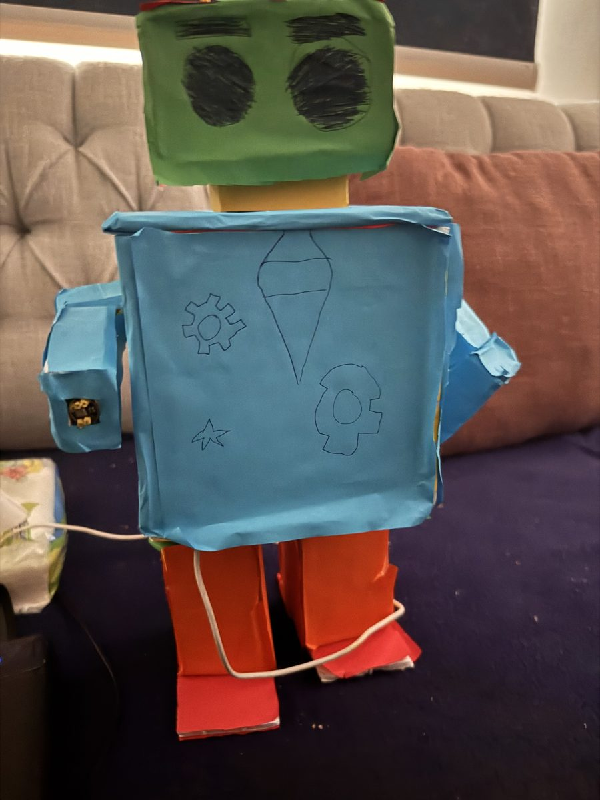 | 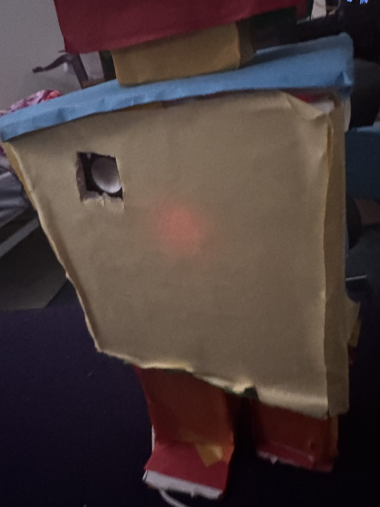 |  |

## Bill of materials

| Qty | Part | Notes |
|---|---|---|
| 1 | ESP32 DevKit V1 (30-pin, "ESP-32" module, micro-USB) | Any ESP32 dev board with the same GPIOs works |
| 1 | INMP441 I2S MEMS microphone module | The small round purple/black board |
| 1 | MAX98357A I2S class-D amplifier module | Green screw terminal for the speaker |
| 1 | Small speaker, 4-8 Ω, 2-3 W | An enclosed mini speaker is used in the build |
| 1 | USB power bank + micro-USB cable | 5 V; the robot draws well under 500 mA |
| ~10 | Female-female Dupont jumper wires | |
| - | Cardboard boxes, coloured paper, tape, glue, toothpicks | The antennae are toothpicks |

## Wiring

Both audio devices use the ESP32's two hardware I2S ports, so the microphone and
the speaker never share a pin.

### INMP441 microphone -> I2S port 0

| INMP441 pin | ESP32 pin | Firmware name |
|---|---|---|
| VDD | 3V3 | |
| GND | GND | |
| SCK | GPIO 25 | `I2S_MIC_SERIAL_CLOCK` |
| WS | GPIO 27 | `I2S_MIC_WORD_SELECT` |
| SD | GPIO 18 | `I2S_MIC_SERIAL_DATA` |
| L/R | GND | selects the left channel (`I2S_CHANNEL_FMT_ONLY_LEFT`) |

### MAX98357A amplifier -> I2S port 1

| MAX98357A pin | ESP32 pin | Firmware name |
|---|---|---|
| VIN | VIN (5 V from USB) | |
| GND | GND | |
| BCLK | GPIO 12 | `I2S_SPK_SERIAL_CLOCK` |
| LRC | GPIO 14 | `I2S_SPK_WORD_SELECT` |
| DIN | GPIO 13 | `I2S_SPK_SERIAL_DATA` |
| GAIN | leave unconnected | 9 dB default; tie to GND for 12 dB |
| SD | leave unconnected | amplifier enabled |
| + / - | speaker | screw terminal |

### Status LED

The on-board blue LED on GPIO 2 is **on while the robot is not connected** to the
server and **off once the WebSocket is registered**. It blinks three times on a
WebSocket error.

## Gotchas learned the hard way

- **GPIO 12 is a boot strapping pin.** It works fine as BCLK here because the
  amplifier input does not pull it high, but if a different amplifier or a pull-up
  ever makes the board fail to boot, move BCLK to another pin (e.g. GPIO 26) and
  change `I2S_SPK_SERIAL_CLOCK`.
- **The INMP441 outputs 24-bit samples in 32-bit frames.** The firmware shifts
  each sample right by 14 bits and multiplies by `MIC_GAIN_MULTIPLIER` (1.5) to get
  a healthy 16-bit signal. If your mic is too quiet or clips, change that gain.
- **Keep the microphone away from the speaker.** That is why the mic lives in the
  arm and the speaker in the back. The firmware also mutes the mic while the robot
  is talking.
- **2.4 GHz WiFi only.** The ESP32 cannot join 5 GHz networks. A phone hotspot works
  well and was used during development.
- **Power the amplifier from VIN (5 V), not 3V3.** On 3V3 the MAX98357A is very
  quiet and can brown out the ESP32 on loud beeps.

## Testing the hardware step by step

1. Flash `firmware/hardware_tests/speaker_beep_test`. You should hear an 800 Hz
   beep every half second, with no WiFi at all. If not, check the amplifier wiring.
2. Flash `firmware/hardware_tests/mic_stream_test` (it needs its own copy of
   `secrets.h`). Start the server and watch its console: the VAD line shows a live
   level bar. Talk near the arm and the bar must jump.
3. Flash `firmware/esp32_voice_assistant`, say "hello robot, what is the weather
   like on Mars?" and wait for the beeps.

## More photos

| | | |
|---|---|---|
| 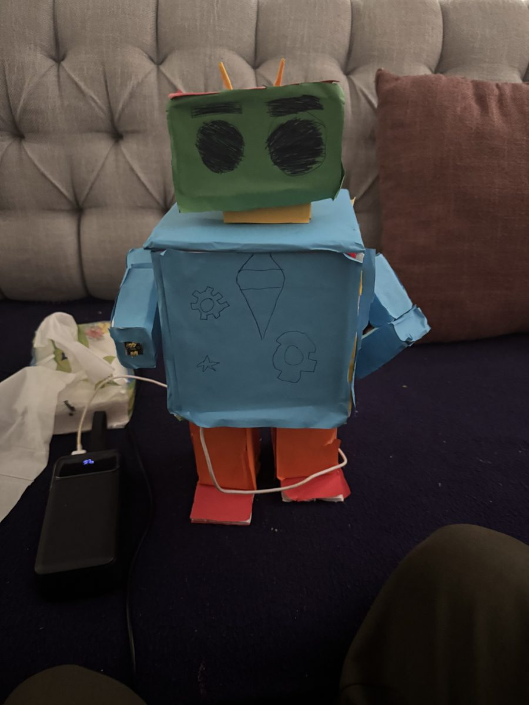 | 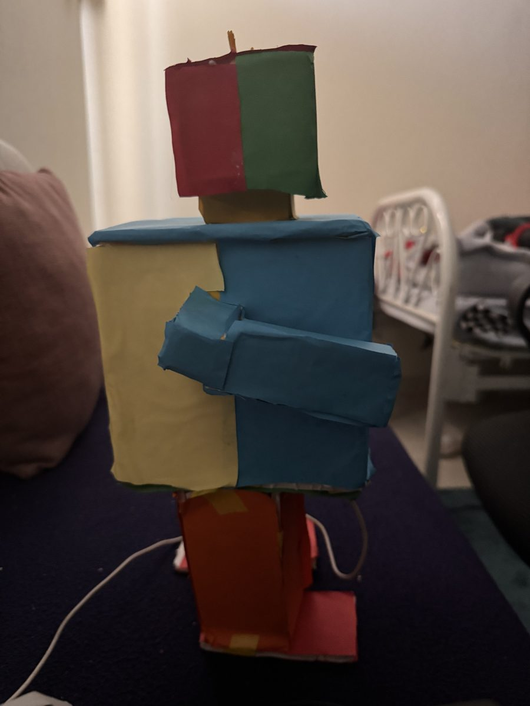 | 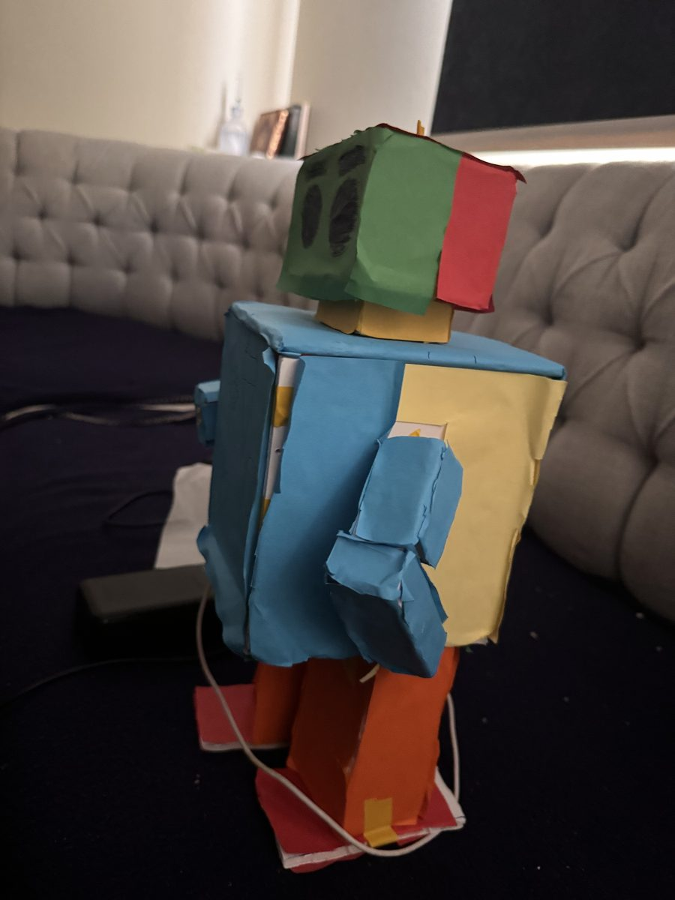 |
| 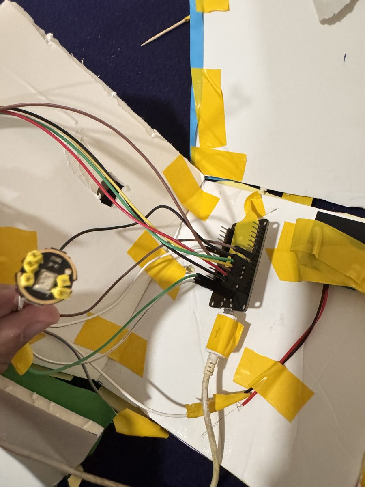 mic module and ESP32 | 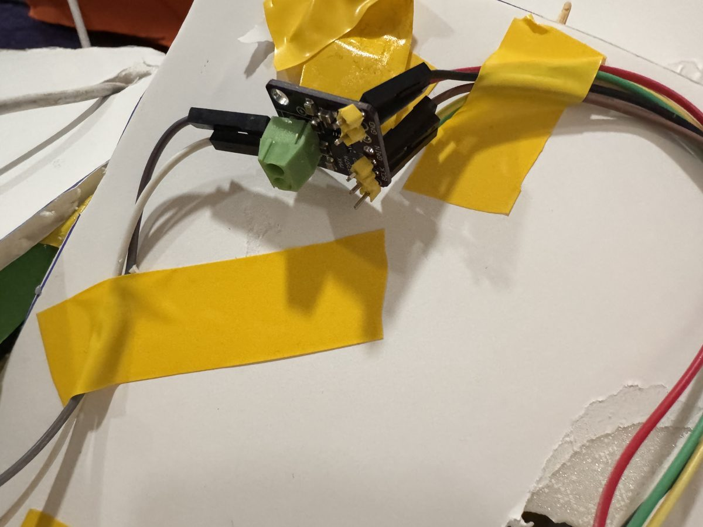 amplifier board | 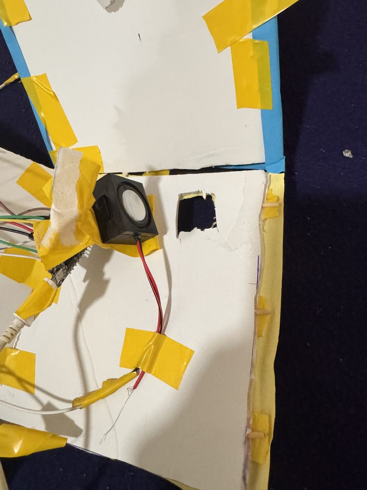 speaker behind the back panel |
| 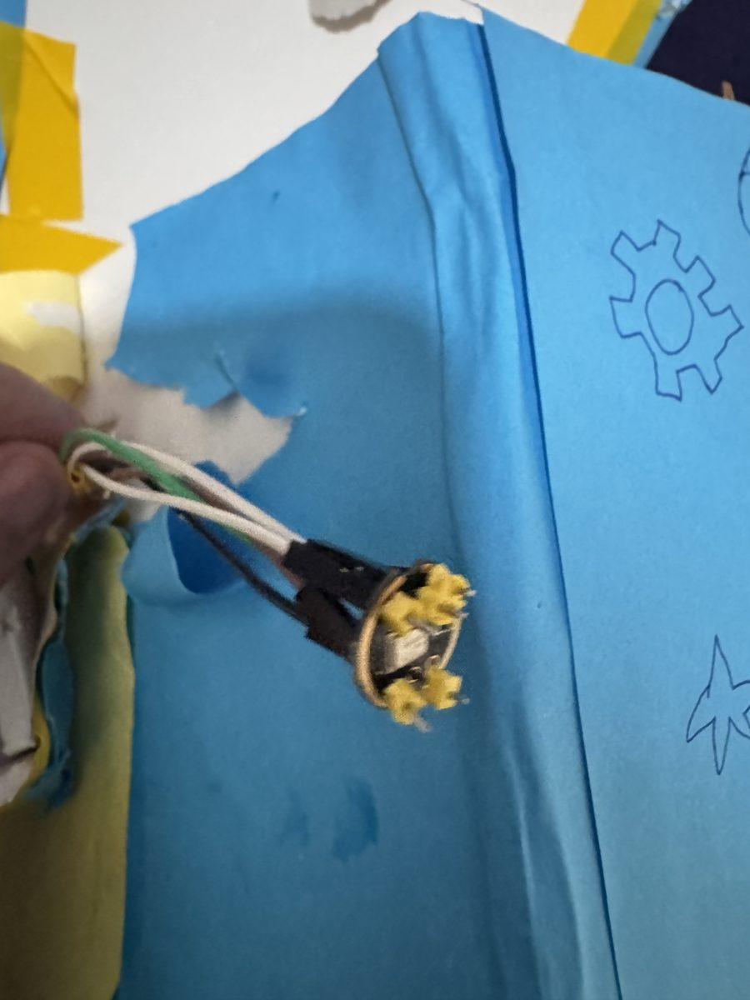 mic inside the arm | 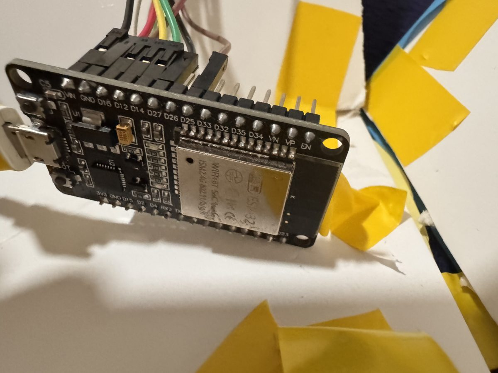 ESP32 DevKit V1 | 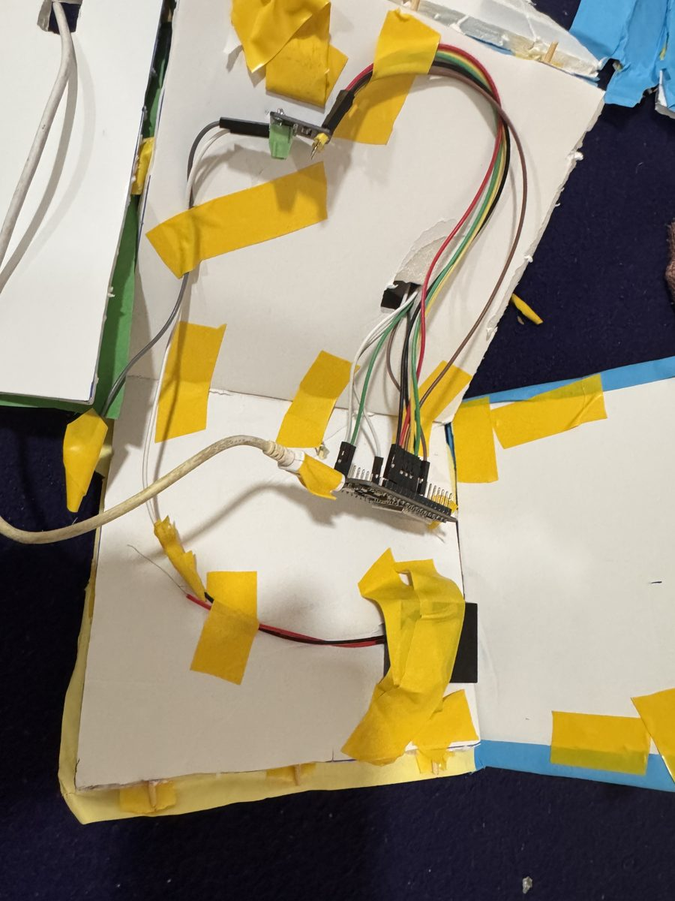 wiring loom |
